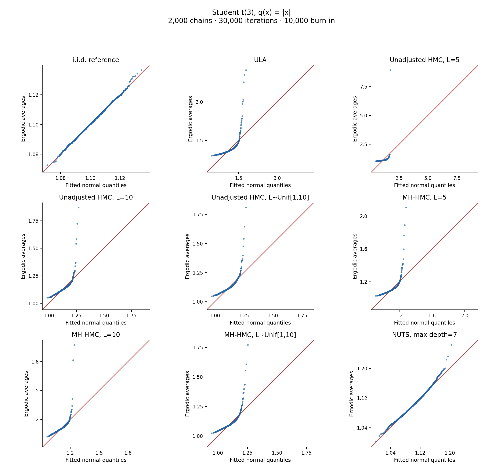

# HMC

[Simple QQ experiments: code, instructions and plots](clt_qq/README.md)
compare ULA, fixed/random-step HMC (adjusted and unadjusted), and NUTS against
an i.i.d. reference.

The examples use `abs(x)` under Student t(3), and `1{x >= 2}` under Student
t(1) and t(1.5). Each sampler runs **2,000 independent chains of 30,000
iterations**, starts them at zero, discards the first 10,000 iterations, and
computes one ergodic average per chain. All samplers support parallel workers.
NUTS uses the standard BlackJAX kernel with its library defaults.

The [three manuscript figures](clt_qq/paper/README.md) use 80,000 retained
iterations per chain: t(3) absolute moments for ULA versus HMC, then Cauchy tail
probabilities for different randomisation laws and lengths and HMC versus NUTS.

```bash
python -m pip install -r clt_qq/requirements.txt
python -m clt_qq.experiment --workers 6
```



QQ plots compare raw chain averages against a fitted Gaussian, with an identity
line and **no square-root-n scaling**. See the [individual plots](clt_qq/examples/simple/individual/)
and [raw chain averages](clt_qq/examples/simple/).

The simulation follows the design of [Brešar, Mijatović and Roberts, Appendix B](https://arxiv.org/html/2512.18255v1#A2)
at a smaller computational scale. QQ shape alone does not prove CLT failure.

The earlier [`SamlerComparison.py`](SamlerComparison.py) compares RWM and
BlackJAX NUTS on a multivariate skew-t target; its dependencies and settings
are documented in that file.
