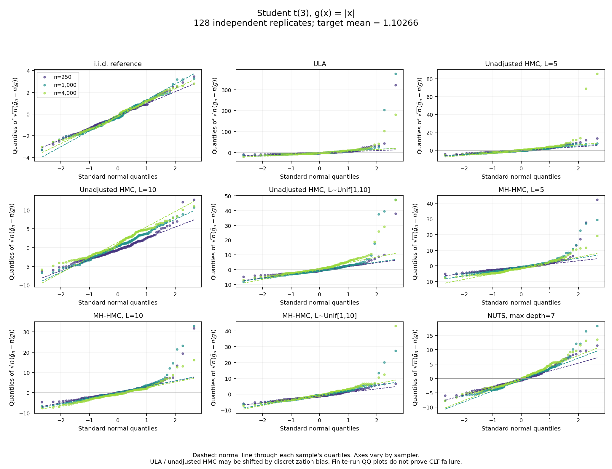

# HMC

## Simple CLT QQ experiments

[Code, instructions and example plots](clt_qq/README.md) compare ULA, adjusted
and unadjusted HMC with fixed/random leapfrog counts, and NUTS against an i.i.d.
reference. The examples use `abs(x)` under Student t(3), and tail probabilities
under Student t(1) and t(1.5).

```bash
python -m pip install -r clt_qq/requirements.txt
python -m clt_qq.experiment --workers 3
```



The QQ points represent independent chain averages. Companion plots check
square-root-n fluctuation widths. These finite-run diagnostics distinguish
non-Gaussian shape from discretization bias; they do not by themselves prove
CLT failure, particularly for NUTS.

## Earlier experiment

[`SamlerComparison.py`](SamlerComparison.py) compares RWM and BlackJAX NUTS on
a multivariate skew-t target. Its dependencies and settings are documented in
that file.
