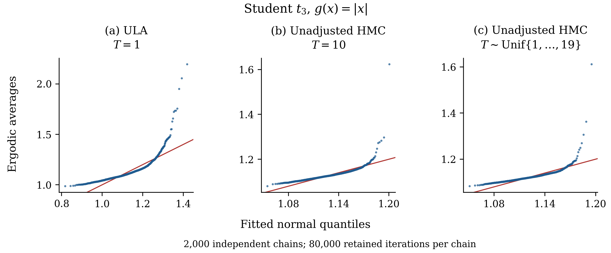

# HMC: companion code and numerical experiments

Code, saved independent-chain averages, and publication figures for the
manuscript *HMC polynomial convergence* by Miha Brešar, Matthew Buckland, and
Aleksandar Mijatović. The experiments compare ULA, HMC with fixed and independently
randomised leapfrog counts, and the standard BlackJAX NUTS kernel on heavy-tailed
Student targets.

**Start with the three paper figures below.** Each panel contains 2,000 independent
chains, each with 40,000 burn-in transitions and **80,000 retained observations**.
One chain contributes one ergodic average and one QQ point. The QQ plots show raw
averages against fitted Gaussian quantiles, without square-root-n scaling or
removal of outliers.

| Figure | Target and observable | Comparison | Files |
| --- | --- | --- | --- |
| 1 | Student t(3), absolute value | ULA; fixed and randomised unadjusted HMC | [PNG](clt_qq/paper/figures/01_ula_fixed_random.png) · [PDF](clt_qq/paper/figures/01_ula_fixed_random.pdf) · [caption](clt_qq/paper/latex/01_ula_fixed_random.tex) |
| 2 | Cauchy, probability of X ≥ 2 | Fixed, uniform and two-point lengths at two matched mean lengths | [PNG](clt_qq/paper/figures/02_randomisation_and_length.png) · [PDF](clt_qq/paper/figures/02_randomisation_and_length.pdf) · [caption](clt_qq/paper/latex/02_randomisation_and_length.tex) |
| 3 | Cauchy, probability of X ≥ 2 | Fixed and randomised Metropolis HMC; NUTS | [PNG](clt_qq/paper/figures/03_hmc_nuts.png) · [PDF](clt_qq/paper/figures/03_hmc_nuts.pdf) · [caption](clt_qq/paper/latex/03_hmc_nuts.tex) |



## Install and check the saved results

Use Python 3.12 or newer. The recorded simulation environment used Python 3.14.2;
the numerical package versions are pinned in [requirements.txt](requirements.txt).
Run commands from the repository root:

```bash
git clone https://github.com/MihaBresar/HMC.git
cd HMC
python -m venv .venv
source .venv/bin/activate
python -m pip install -r requirements.txt
python -m clt_qq.verify_paper
```

On Windows, activate the environment with `.venv\Scripts\Activate.ps1` instead.
No GPU or LaTeX installation is needed for the experiments or figure rendering.

Rebuild the three figures directly from the bundled averages, without running
the simulations again:

```bash
python -m clt_qq.paper_figures --output clt_qq/output/paper_figures
```

For a fresh simulation, resuming only compatible results in the chosen directory:

```bash
python -m clt_qq.paper_experiment --case t3_abs --workers 6 --batch-size 128 --nuts-batch-size 4 --output clt_qq/output/paper_reproduction/t3_abs
python -m clt_qq.paper_experiment --case t1_tail --workers 6 --batch-size 128 --nuts-batch-size 4 --output clt_qq/output/paper_reproduction/t1_tail
python -m clt_qq.paper_figures --data clt_qq/output/paper_reproduction --output clt_qq/output/paper_reproduction/figures
```

The full experiment runs 24,000 chains and 2.88 billion transitions, including
burn-in. See the [reproduction guide](docs/REPRODUCING.md) for a short smoke test,
parallelism, random seeds, resuming, and environment details.

## Repository guide

| Location | Contents |
| --- | --- |
| [clt_qq/experiment.py](clt_qq/experiment.py), [nuts.py](clt_qq/nuts.py) | Samplers, independent-chain execution, and diagnostics |
| [clt_qq/paper_experiment.py](clt_qq/paper_experiment.py) | Paper settings and resumable simulation |
| [clt_qq/paper_figures.py](clt_qq/paper_figures.py) | Three paper figures from saved averages |
| [clt_qq/paper/data_80k/](clt_qq/paper/data_80k/) | Complete paper chain averages, configurations, summaries, and diagnostics |
| [clt_qq/paper/figures/](clt_qq/paper/figures/) | Vector PDFs, PNGs, and source-hash/panel manifest |
| [clt_qq/paper/latex/](clt_qq/paper/latex/) | Ready-to-paste figure environments and captions |
| [docs/FIGURES.md](docs/FIGURES.md) | Exact manuscript insertion anchors and LaTeX instructions |
| [docs/DATA.md](docs/DATA.md) | Data format, method identifiers, and diagnostic definitions |
| [clt_qq/README.md](clt_qq/README.md) | General experiments, including t(1.5) and i.i.d. comparisons |
| [clt_qq/examples/](clt_qq/examples/), [clt_qq/paper/data/](clt_qq/paper/data/) | Earlier experiments, explicitly labelled as historical |

Run the automated checks with:

```bash
python -m unittest discover -s clt_qq -t . -v
python -m clt_qq.verify_paper
```

The tests check sampler transitions, retained averages, random-stream
reproducibility, resume behaviour, and saved-data consistency. GitHub Actions
runs these checks; it does not rerun the full paper simulations.

## Interpretation and provenance

All paper runs start at zero and use fixed step size 0.35 and unit mass. NUTS
uses BlackJAX 1.6.2 with its default trajectory construction and limit; tuning
is fixed, with no adaptation. Independent random HMC lengths are redrawn every
transition. Comparisons use equal transition counts; gradient work differs.

These are finite-run distributional comparisons. A fitted-normal QQ plot does
not prove or disprove a CLT, determine a convergence rate, or expose bias in the
fitted location. The unadjusted samplers may have invariant-distribution bias.
Axes have separate ranges, so the identity reference need not look like a
45-degree line. See the [paper experiment notes](clt_qq/paper/README.md) for the
full design and interpretation.

The independent-chain design was informed by Appendix B of
[Brešar, Mijatović and Roberts](https://arxiv.org/html/2512.18255v1#A2), a separate
paper with much larger simulation budgets. The saved chain averages and their
configurations are the reference for this repository's figures. Cite this
repository with the commit used to reproduce the results; no manuscript DOI
or published version is assigned here.

[SamlerComparison.py](SamlerComparison.py) is an earlier, separate multivariate
skew-t/RWM/NUTS example, retained under its original filename. It uses different
tuning, targets, and QQ construction and does not generate the three paper
figures. Manuscript drafts and editorial working files are outside the companion
code distribution.
